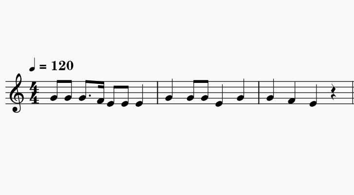

# Melody Generation using Long Term Short Term

Dive into the enchanting world of music generation with the power of Long Short-Term Memory (LSTM) networks! 🎶🧠

This project takes you on a journey into the realm of melodic composition by harnessing the capabilities of Recurrent Neural Networks (RNNs), particularly LSTMs. Melodies are more than just sequences of notes and rests; they contain intricate temporal patterns and structures that make them ideal for LSTM-based music generation.

Our approach begins with the [German section](https://kern.humdrum.org/cgi-bin/browse?l=essen/europa/deutschl) of the extensive ESAC dataset, where we extract music partitions. These partitions are transformed into a time series format, creating a rich dataset that captures the nuanced rhythms, harmonies, and melodies of various musical compositions.

Why LSTMs, you might ask? LSTMs excel at modeling sequences and are uniquely suited to handle the long-term dependencies present in melodies. They're adept at capturing musical nuances that simple feedforward networks may miss.

Through this project, we explore the creative possibilities of algorithmic composition. You can leverage the code to generate melodies, harmonies, and musical sequences that follow familiar patterns while introducing innovative variations. Whether you're a musician looking for inspiration or a data scientist delving into the world of generative AI, this is definetely a fun project worth looking into.

For this project, we are using the [ESAC database](http://www.esac-data.org/) which has over
20k traditional folk songs from all over the world.

Feel free to explore the code! If you have questions, ideas, or feedback, please don't hesitate to share them. Together, we'll keep the music flowing. 🎵🤖

Resources:
- Valerio Velardo - The Sound of AI (https://www.youtube.com/@ValerioVelardoTheSoundofAI)
